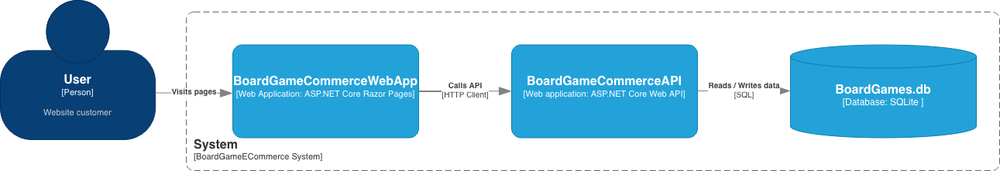

# Board Game eCommerce 

C# .NET Razor Pages project utilising a web API designed to be an eCommerce engine to support a mock board game retail business. 

## Demo


## Structure


## Features

* Record eCommerce transactions in SQLite DB including data on:
    * Products
    * Sales
    * Customers
* Provide User-Interface with Razor Pages ASP.NET Core, including:
    * User Registration & Login with POST/GET
    * Basket & Checkout to complete a sale with POST request
    * Complete product catalogue display with search capability (GET)
    * Past order catalogue available for logged in user


## To-Do

* Admin endpoints in API and front-end dashboard
  * Introudce role based authentication and authorisation to access all sales and customer information
* Inputs validation, add requirements for password, email etc... format
* Improve exception handling in API
* Improve error handling in front-end from API status codes and error messages

## Pre-requsites 

### Dependencies 

* .NET 10.0 installation


## Run Locally

Clone the project

```bash
  git clone git@github.com:cesca2/BoardGameECommerce.git
```

Go to the project directory

```bash
  cd BoardGameECommerce
```

Run the applications

```bash
  dotnet run --project BoardGameCommerceAPI
  dotnet run --project BoardGameCommerceApp
```


## API Reference

### Authorisation

JWT token generation on user login. Authorised users can access their information, order history and create a new order. Unauthorised users can access all Products endpoints and create login/registration. 

### Get products

```http
  GET /api/Products
```
| Parameter | Type     | Description                       |
| :-------- | :------- | :-------------------------------- |
| `id`      | `string` | **optional**. Id of item to fetch , must be valid Guid|

| Query Parameters | Type     | Description                       |
| :-------- | :------- | :-------------------------------- |
| `SearchTerm`      | `string` | **Optional**. Key term to filter product name  |


### Register customer

```http
  POST /api/Customers/register
```

EXAMPLE INPUT:
```json
{
  "name": Jane Doe,
  "email": "jdoe@email.com",
  "password": "password123",
}

```
| Field      | Type    | Required | Description                           |
| ---------- | ------- | -------- | ----------------------------------    |
| `name`    | string  | Yes      | Name of customer. |
| `email` | string  | Yes      | Customer email. |
| `password`     | string  | Yes     | Customer password.  |

SUCCESSFUL RESPONSE: JWT token

### Login Customer

```http
  POST /api/Customers/login
```

EXAMPLE INPUT:
```json
{
  "email": "jdoe@email.com",
  "password": "password123",
}

```
| Field      | Type    | Required | Description                           |
| ---------- | ------- | -------- | ----------------------------------    |
| `password`    | string  | Yes      | Customer password. |
| `email` | string  | Yes      | Customer email. |

SUCCESSFUL RESPONSE: JWT token

### Create Sale

```http
  POST /api/Sales
```

AUTHORISATION: Requires valid Bearer token

EXAMPLE INPUT:
```json
{
    "quantitiesByProductID": {
      "3fa85f64-5717-4562-b3fc-2c963f66afa2": 1,
      "3fa85f64-5717-4562-b3fc-2c963f66afa1": 2,
      "3fa85f64-5717-4562-b3fc-2c963f66afa4": 3
    }
    "date": "29-05-2026", 
    "time: "15:30",
}
```
| Field      | Type    | Required | Description                           |
| ---------- | ------- | -------- | ----------------------------------    |
| `quantitiesByProductID` | Dictionary<Guid, int> | Yes      | Product Ids, valid Guid as in /Products endpoint with associated quantity included in the sale.|
| `date` | DateOnly | Yes      | Date of transaction. |
| `date` | TimeOnly | Yes      | Time of transaction. |

### Retrieve Sales Associated to Customer

```http
  GET/api/Sales
```

AUTHORISATION: Requires valid Bearer token

EXAMPLE OUTPUT: 
```json
{
    "id": "3fa85f64-5717-4562-b3fc-2c963f66afa9",
    "customer_id": "3fa85f64-5717-4562-b3fc-2c963f76afa9",
    "quantitiesByProductID": {
      "3fa85f64-5717-4562-b3fc-2c963f66afa2": 1,
      "3fa85f64-5717-4562-b3fc-2c963f66afa1": 2,
      "3fa85f64-5717-4562-b3fc-2c963f66afa4": 3
    }
    "date": "29-05-2026", 
    "time: "15:30",
}
```

| Field      | Type    | Required | Description                           |
| ---------- | ------- | -------- | ----------------------------------    |
| `quantitiesByProductID` | Dictionary<Guid, int> | Yes      | Product Ids, valid Guid as in /Products endpoint with associated quantity included in the sale.|
| `date` | DateOnly | Yes      | Date of transaction. |
| `date` | TimeOnly | Yes      | Time of transaction. |

## Database information and acknowledgements
Data used to populate mock products are sourced from BoardGameGeek BGG XML API https://boardgamegeek.com/using_the_xml_api, and BoardGamePrices https://boardgameprices.co.uk/api/plugin.

`.csv` files containing data directly from these files is found under `BoardGameData` and these data are used to initialise the Products table. 

## Acknowledgements

Original project inspiration from https://www.thecsharpacademy.com/project/18/ecommerce-api 