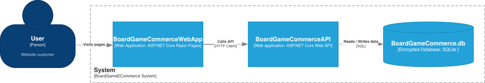

# Board Game eCommerce System

[](https://github.com/cesca2/BoardGameECommerce/actions/workflows/dotnet.yml)
[](https://github.com/cesca2/BoardGameECommerce/actions/workflows/dotnet-format.yml)

C# .NET eCommerce system incorporating an ASP.NET Core Web API designed to be an eCommerce engine to support a mock board game retail business. The user interface is serviced by a Razor Pages web application. 

## Demo


## System Structure


## Features

* Record eCommerce transactions in ASP.NET Core Web API using an SQLite DB including data on:
    * Products
    * Sales
    * Customers
* Provide User-Interface with Razor Pages ASP.NET Core, including:
    * User Registration & Login with POST/GET
    * Basket & Checkout to complete a sale with POST request
    * Complete product catalogue display with search capability (GET)
    * Past order catalogue available for logged in user
* Role-based authorisation for resource access in API see [Authorisation structure](#authorisation) 

## Pre-requisites 

### Dependencies 

* .NET 10.0 installation


## Run Locally

Clone the project

```bash
   git clone git@github.com:cesca2/BoardGameECommerce.git
```

Go to the project directory

```bash
   cd BoardGameECommerce
```

Set up the user-secrets. Edit `BoardGameCommerceAPI/secrets_input_example.json`, then run (macOS/Linux)
```bash
   cd BoardGameCommerceAPI
   mv ./secrets_input_example.json ./secrets.json 
   cat ./secrets.json | dotnet user-secrets set
``` 

Run the applications

```bash
   dotnet run --project BoardGameCommerceAPI
   dotnet run --project BoardGameCommerceApp
```

(Optional) To reset the database at any point run 
```bash
   dotnet run --project BoardGameCommerceAPI --ReInitialize=true 
```

## Formatting
This project uses CSharpier v1.2.6.0, any files committed to the repository are checked in the Format .NET projects GitHub action.

## Testing 
Tests are ran in CI workflow, see [Build and Test .NET projects](https://github.com/cesca2/BoardGameECommerce/actions/workflows/dotnet.yml)

To run testing:
```bash
   dotnet test BoardGameCommerceAPI.IntegrationTests
```
Use` Microsoft.AspNetCore.Mvc.Testing.WebApplicationFactory` to build application in memory to perform integration testing.

Testing breakdown:
* BoardGameCommerceAPI.IntegrationTests: xunit
     * UserExperienceTests: Tests user journey - logon, create order, see order details
     * ProductsControllerTests: Tests `/products` endpoints
     * SalesControllerTests: Tests `/sales` endpoints, includes authorisation tests
     * CustomersControllerTests: Tests `/customers` endpoints, includes authorisation tests


## API Reference

### Authorisation

JWT token generation on user login. Authenticated users are assigned either 'Customer' or 'Admin' role. 

Authorisation structure:
* Unauthenticated users can access all product information and create login/registration requests.
* Authenticated customers can access their own information, order history and create a new order.
* Authenticated admins have customer priveledges and can additionally access user information and orders associated to all customers.


### Get products

```http
  GET /api/products
```
| Parameter | Type     | Description                       |
| :-------- | :------- | :-------------------------------- |
| `id`      | `string` | **optional**. Id of item to fetch , must be valid Guid|

| Query Parameters | Type     | Description                       |
| :-------- | :------- | :-------------------------------- |
| `SearchTerm`      | `string` | **Optional**. Key term to filter product name  |


### Register customer

```http
  POST /api/customers/register
```

**EXAMPLE INPUT:**
```json
{
  "name": "Jane Doe",
  "email": "jdoe@email.com",
  "password": "password123"
}

```
| Field      | Type    | Required | Description                           |
| ---------- | ------- | -------- | ----------------------------------    |
| `name`    | `string`  | Yes      | Name of customer. |
| `email` | `string`  | Yes      | Customer email. |
| `password`     | `string`  | Yes     | Customer password.  |

**SUCCESSFUL RESPONSE: JWT token** 

### Login Customer

```http
  POST /api/customers/login
```

**EXAMPLE INPUT:** 
```json
{
  "email": "jdoe@email.com",
  "password": "password123"
}

```
| Field      | Type    | Required | Description                           |
| ---------- | ------- | -------- | ----------------------------------    |
| `password`    | `string`  | Yes      | Customer password. |
| `email` | `string`  | Yes      | Customer email. |

**SUCCESSFUL RESPONSE: JWT token**

### Retrieve customer details

```http
  GET /api/customers/me
```
**AUTHORISATION: Requires valid Bearer token**

**EXAMPLE OUTPUT**:
```json
{
  "id": "347f574e-d38d-4024-b92f-d653377dee7f",
  "name": "Jane Doe",
  "email": "jdoe@email.com"
}
```

| Field      | Type   |  Description                           |
| ---------- | ------- | ----------------------------------    |
| `id`    | `Guid`   | Customer ID |
| `name` | `string`  | Customer name. |
| `email` | `string`  | Customer email. |


### Create Sale

```http
  POST /api/sales
```

**AUTHORISATION: Requires valid Bearer token**

**EXAMPLE INPUT:**
```json
{
    "quantitiesByProductID": {
      "6d72464c-6f49-4eba-a4ac-23f92ee23e13": 1,
      "f1e73cb3-bccc-45b0-9e41-53e85bae6e41": 2,
    }
    "date": "29-05-2026", 
    "time": "15:30"
}
```
| Field      | Type    | Required | Description                           |
| ---------- | ------- | -------- | ----------------------------------    |
| `quantitiesByProductID` | `Dictionary<Guid, int>` | Yes      | Product Ids, valid Guid as in /Products endpoint with associated quantity included in the sale.|
| `date` | `DateOnly` | Yes      | Date of transaction. |
| `time` | `TimeOnly` | Yes      | Time of transaction. |

### Retrieve Sales Associated to Customer

```http
  GET /api/sales
```

**AUTHORISATION: Requires valid Bearer token**

**EXAMPLE OUTPUT:**
```json
[
  {
    "id": "4f17b797-3b72-4c17-be84-6bb4df86d1f9",
    "customer_Id": "347f574e-d38d-4024-b92f-d653377dee7f",
    "quantitiesByProductID": {
      "6d72464c-6f49-4eba-a4ac-23f92ee23e13": 1,
      "f1e73cb3-bccc-45b0-9e41-53e85bae6e41": 1
    },
    "date": "2026-06-02",
    "time": "11:34:00"
  },
  {
    "id": "2991b079-1e9b-4bec-8c11-8a5041c867cc",
    "customer_Id": "347f574e-d38d-4024-b92f-d653377dee7f",
    "quantitiesByProductID": {
      "6d72464c-6f49-4eba-a4ac-23f92ee23e13": 1
    },
    "date": "2026-06-02",
    "time": "11:35:00"
  }
]
```

| Field      | Type    | Description                           |
| ---------- | ------- |  ----------------------------------    |
| `id`    | `Guid` |  Sale ID |
| `customer_Id`    | `Guid` |  Customer ID |
| `quantitiesByProductID` | `Dictionary<Guid, int>` |  Product Ids, valid Guid as in /Products endpoint with associated quantity included in the sale.|
| `date` | `DateOnly` | Date of transaction. |
| `time` | `TimeOnly` | Time of transaction. |

### Retrieve Customer Details Associated to all Customers

```http
  GET /api/customers/admin
```

**AUTHORISATION: Requires valid Bearer token with Admin role**

**EXAMPLE OUTPUT:**
```json
[
  {
    "id": "347f574e-d38d-4024-b92f-d653377dee7f"
    "name": "Jane Doe",
    "email": "jdoe@email.com"
  },
  {
    "id": "afb4d6a7-d8f1-4362-b06b-3cb2448edfe0",
    "name": "John Smith",
    "email": "jsmith@email.com"
  }
]
```

| Field      | Type   |  Description                           |
| ---------- | ------- | ----------------------------------    |
| `id`    | `Guid` |  Customer ID |
| `name` | `string`  | Customer name. |
| `email` | `string`  | Customer email. |


### Retrieve Sales Details Associated to all Customers

```http
  GET /api/sales/admin
```

| Parameter | Type     | Description                       |
| :-------- | :------- | :-------------------------------- |
| `id`      | `string` | **optional**. Id of item to fetch , must be valid Guid|

**AUTHORISATION: Requires valid Bearer token with Admin role**

**EXAMPLE OUTPUT:**
```json
[
  {
    "id": "4f17b797-3b72-4c17-be84-6bb4df86d1f9",
    "customer_Id": "347f574e-d38d-4024-b92f-d653377dee7f",
    "quantitiesByProductID": {
      "6d72464c-6f49-4eba-a4ac-23f92ee23e13": 1,
      "f1e73cb3-bccc-45b0-9e41-53e85bae6e41": 1
    },
    "date": "2026-06-02",
    "time": "11:34:00"
  },
]
```

| Field      | Type    | Description                           |
| ---------- | ------- |  ----------------------------------    |
| `id`    | `Guid` |  Sale ID |
| `customer_Id`    | `Guid` |  Customer ID |
| `quantitiesByProductID` | `Dictionary<Guid, int>` |  Product Ids, valid Guid as in /Products endpoint with associated quantity included in the sale.|
| `date` | `DateOnly` | Date of transaction. |
| `time` | `TimeOnly` | Time of transaction. |

## Database information and acknowledgements
Data used to populate mock products are sourced from BoardGameGeek BGG XML API https://boardgamegeek.com/using_the_xml_api, and BoardGamePrices https://boardgameprices.co.uk/api/plugin.

`.csv` files containing data directly from these files are found under `BoardGameCommerceAPI/BoardGameData` and these data are used to initialise the Products table. 

## Acknowledgements

Original project inspiration from https://www.thecsharpacademy.com/project/18/ecommerce-api 

## To-Do

* Improve error handling in front-end from API status codes and error messages
* Check DateTime consistency from front-end
